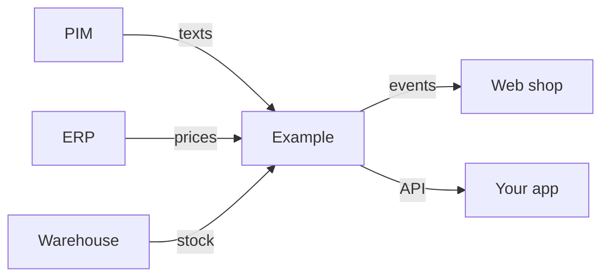

## Code blocks

```csharp title="Startup/ExampleSetup.cs" showLineNumbers
public static class ExampleSetup
{
    public static IServiceCollection AddCatalog(this IServiceCollection services)
    {
        // highlight-next-line
        services.AddEntity<Product>();
        services.AddEntity<Category>();
        return services;
    }
}
```

```json title="appsettings.json"
{
  "Example": {
    "EnableAdminUi": true,
    "MaxBatchSize": 500
  }
}
```

```http
GET /api/products/42 HTTP/1.1
Accept: application/json
```

```diff
- services.AddEntity<Product>();
+ services.AddEntity<Product>(o => o.EnableHistory = true);
```

## Tabs

Tabs with the same `groupId` stay in sync across the page.

<Tabs groupId="client">
  <TabItem value="curl" label="curl" default>

```bash
curl -X POST https://localhost:5001/api/products -d @product.json
```

  </TabItem>
  <TabItem value="csharp" label="C#">

```csharp
await http.PostAsJsonAsync("/api/products", product);
```

  </TabItem>
</Tabs>

## Mermaid diagrams


